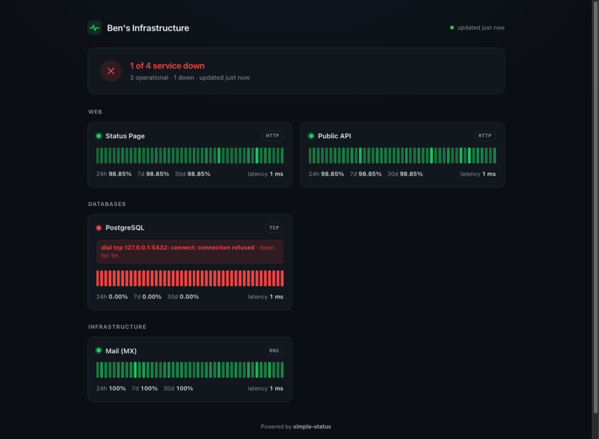

# simple-status

A self-hosted status page with automated service checks — like Uptime Kuma,
but without the management UI. You configure everything in a single YAML file
(plus a few CLI flags), and simple-status takes care of the pinging and
serves a beautiful, read-only status page.



## Features

- **Automated checks** on a per-service interval, with per-service timeouts.
- **Multiple service types**, built in: `http` (status code, optional body
  pattern), `tcp` (port), `dns` (record lookup). New types plug into the
  probe registry.
- **Beautiful read-only status page** — light/dark theme, heartbeat bars,
  uptime windows (24 h / 7 d / 30 d), outage durations. No web management
  interface, no database.
- **Single static binary** with the UI embedded; also available as a tiny
  distroless Docker image.
- **JSON API** (`/api/v1/summary`, `/api/v1/services/{id}`) for dashboards
  and scripts.
- **Flap protection**: a service only goes *down* after a configurable number
  of consecutive failures and recovers on the first success.

Non-goals by design: editing the configuration via the web (use a file —
it belongs in version control), authentication on the status page (put it
behind a reverse proxy if you need it), persistent history across restarts,
and notification channels.

## Quickstart

Download a [release](../../releases) binary, or:

```sh
go install simple-status/cmd/simple-status@latest   # after publishing a fork
```

Then:

```sh
cp config.example.yml simple-status.yml   # edit to your liking
simple-status --validate                   # sanity-check the file
simple-status                              # serve the status page on :8080
```

### Docker

```sh
docker build -t simple-status .
docker run -p 8080:8080 -v "$PWD/simple-status.yml:/etc/simple-status/config.yml:ro" simple-status
```

Or with `docker compose up -d` (see [docker-compose.yml](docker-compose.yml)).

## Usage

```
simple-status [flags]
```

| Flag | Default | Description |
| --- | --- | --- |
| `--config` | `simple-status.yml` | Path to the YAML configuration file. |
| `--listen` | from config, `:8080` | Listen address; overrides the config file. |
| `--interval` | from config, `30s` | Default check interval; overrides the config file. |
| `--timeout` | from config, `10s` | Default check timeout; overrides the config file. |
| `--validate` | – | Validate the configuration and exit (exit code 0/1). |
| `--once` | – | Check every service once, print a table and exit. Exit code 1 if anything is down — handy in scripts and CI. |
| `--version` | – | Print version and exit. |

Configuration precedence: **CLI flag < config file < per-service value < built-in
default** — i.e. a service-level `interval` always wins over `--interval`,
which wins over the built-in default.

## Configuration reference

One YAML file, `simple-status.yml` by default. Durations use Go syntax
(`30s`, `1m`, `1h30m`).

### Root settings

| Key | Default | Description |
| --- | --- | --- |
| `title` | `Status` | Title shown on the status page. |
| `listen` | `:8080` | Address to serve the status page and API on. |
| `interval` | `30s` | Default time between two checks. |
| `timeout` | `10s` | Default deadline for a single check (must not exceed the interval). |
| `retries` | `1` | Default number of consecutive failures before a service is down. |
| `history` | `720` | Check results kept per service (in memory). |
| `services` | – | The list of monitored services, in display order. |

### Service settings

| Key | Required | Description |
| --- | --- | --- |
| `id` | ✔ | Unique, URL-safe identifier (`[a-zA-Z0-9][a-zA-Z0-9_-]*`), used in API paths. |
| `name` | – | Display name; defaults to `id`. |
| `group` | – | Optional group heading on the status page. |
| `type` | ✔ | Probe type: `http`, `tcp` or `dns`. |
| `target` | ✔ | Probe target, see below. |
| `interval`, `timeout`, `retries` | – | Per-service overrides of the root settings. |

#### `http`

`target` is a full URL including scheme. A check succeeds when the response
status is accepted and, if configured, the body matches.

| Key | Default | Description |
| --- | --- | --- |
| `method` | `GET` | HTTP method to use. |
| `headers` | – | Extra request headers (e.g. `Accept`). |
| `expected_statuses` | any `2xx` | Exact list of accepted status codes, e.g. `[200, 204]`. |
| `body_pattern` | – | Regular expression the response body (first 1 MB) must match. |
| `insecure_tls` | `false` | Skip certificate verification (self-signed endpoints). |

#### `tcp`

`target` is `host:port`. A check succeeds when a TCP connection can be
established.

#### `dns`

`target` is the name to resolve. A check succeeds when the lookup returns at
least one record.

| Key | Default | Description |
| --- | --- | --- |
| `record` | `A` | Record type: `A`, `AAAA`, `CNAME`, `MX`, `NS` or `TXT`. |
| `resolver` | system | DNS server to query, `host` or `host:port` (port defaults to 53). |

## Status page & API

The page at `/` refreshes itself every 10 seconds. Endpoints:

| Endpoint | Description |
| --- | --- |
| `GET /api/v1/summary` | Overall status plus a snapshot of every service (current status, latency, uptime windows, recent history). |
| `GET /api/v1/services/{id}` | Full detail for one service, including its incident log. |
| `GET /healthz` | Liveness of simple-status itself. |

## Security notes

- The status page and API are **public and unauthenticated** by design.
  Expose them on a private network or behind an authenticating reverse
  proxy if your service list is sensitive.
- Avoid `insecure_tls` on public endpoints; it is meant for internal
  endpoints with self-signed certificates.
- Check secrets in `headers` (e.g. `Authorization`) end up in the config
  file — keep the file's permissions tight (`chmod 600`).

## Development

```sh
make test    # go test -race ./...
make lint    # golangci-lint run
make build   # static binary in bin/
make run     # build and run with simple-status.yml
```

Requires Go ≥ 1.25. See [CONTRIBUTING.md](CONTRIBUTING.md) for the workflow.
The Go module is named `simple-status`; rename it to your repository path
(`go mod edit -module github.com/you/simple-status` and fix the imports)
when you publish a fork.

## License

[MIT](LICENSE)
